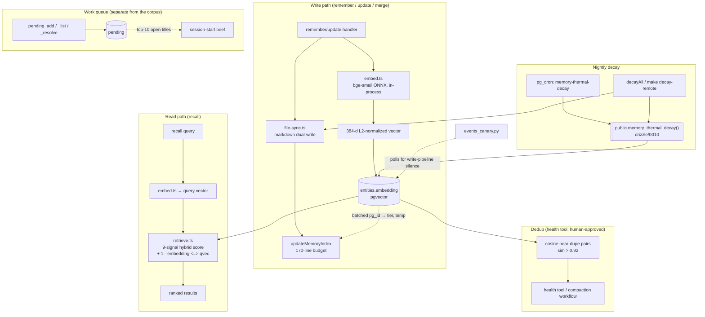
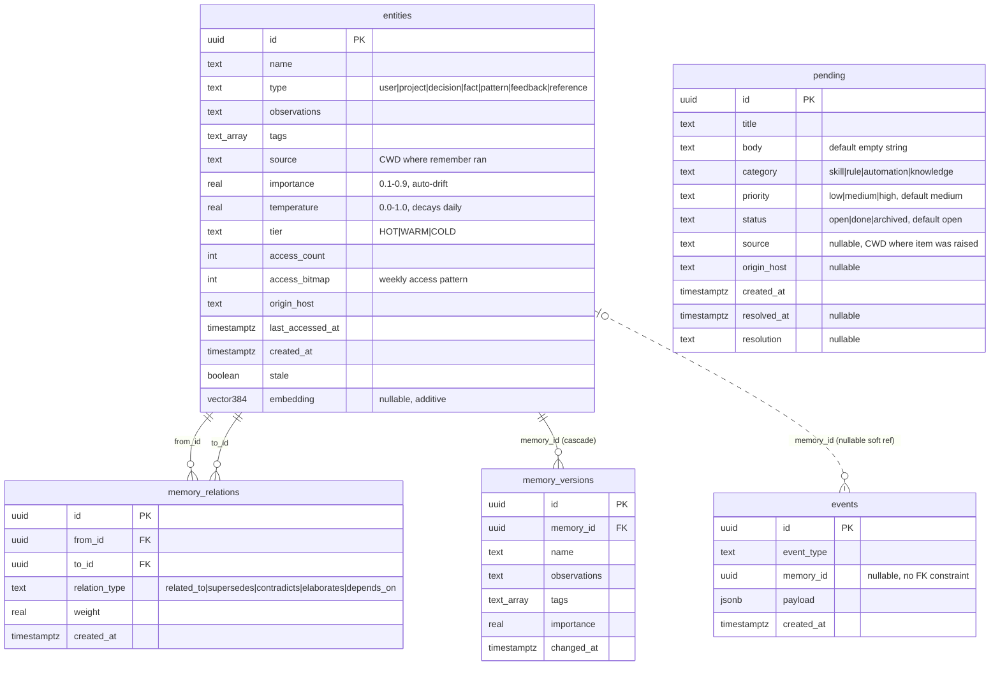

# Architecture

`memory-persistor` is an MCP memory server: a PostgreSQL-backed store with thermal
decay, a knowledge graph, and **9-signal hybrid retrieval**, optionally dual-written
to a directory of markdown memory files. This document maps the runtime data flow and
the database schema.

For the high-level component view, see the [README](../README.md#architecture).

## Data flow

The three hot paths — **write**, **read**, and **dedup** — all pivot on the `entities`
table and its additive `embedding vector(384)` column. The work queue is a fourth,
deliberately separate path.

- **Write** — `remember` / `update` / `merge` embed `name + "\n" + observations` via the
  in-process `embed.ts` singleton (bge-small-384, ONNX, fp32) and persist the 384-d
  vector alongside the row. Embedding failure is **non-fatal** (the row is stored with
  `NULL` and a later backfill fills it in). The same call dual-writes the markdown file.
- **Read** — `recall` embeds the query once and adds `(1 - (embedding <=> qvec)) × 0.12`
  as the 9th signal, `COALESCE`d to `0` for NULL-embedding rows so lexical-only matches
  still rank.
- **Dedup** — `health` surfaces cosine near-duplicate pairs above `0.92` for
  human-approved `merge`. Nothing is ever auto-merged.
- **Index** — every markdown write rebuilds the directory's index under a 170-line
  budget, ranking retention on **live Postgres** tier/temperature via one batched
  `pg_id` lookup per rebuild. `user` and `feedback` entries are retained first, then
  HOT > WARM > COLD, then temperature, then filename in codepoint order. If the
  database is unreachable the whole index falls back to frontmatter ranking — never a
  mix — and a `pg_id` with no row ranks at temperature 0 so orphans cannot outrank
  live memories.
- **Decay** — the nightly `pg_cron` job and a manual `make decay-remote` call the same
  version-controlled `public.memory_thermal_decay()`. Postgres cannot reach any
  machine's filesystem, so the scheduled path updates rows only; `decayAll()` adds the
  markdown half and rebuilds each affected directory's index **once**, on the last
  write into it.
- **Queue** — `pending_*` writes and reads the `pending` table and touches nothing else.
  Note that `pending_list` deliberately logs **no** event: it is a read-only call that
  typically fires on every session start, and logging it would keep the event stream
  permanently "fresh", defeating `events_canary.py`'s write-pipeline check.

## Database schema

Five tables. `entities` is the spine; `memory_relations` is the knowledge graph;
`memory_versions` is the audit trail; `events` is fire-and-forget observability;
`pending` is a standalone work queue with no relationship to the memory corpus.

`pending` has no edge to `entities` in the diagram above — that isolation is
deliberate, not an omission. It is a work queue, not memory: no thermal decay,
no embedding, no graph edges, no markdown mirror, and no FK to `entities`. It
lives in the same database purely so a session-start hook needs one connection
(see `src/schema.ts`'s comment above the table definition).

- **entities** — one row per memory. `embedding vector(384)` is nullable and additive
  (no ANN index — exact brute-force cosine `<=>` is sub-millisecond at this corpus size).
- **memory_relations** — typed graph edges; both `from_id` and `to_id` cascade-delete
  with the entity, so removing a memory tears down its edges.
- **memory_versions** — a snapshot of `name` / `observations` / `tags` / `importance`
  taken before each `update`; cascade-deletes with the entity.
- **events** — every mutating tool call logs here (fire-and-forget, non-blocking).
  `memory_id` is a **nullable soft reference** with no FK constraint, so event logging
  never blocks on or is torn down by entity lifecycle.
- **pending** — a deferred-work queue (`pending_add` / `pending_list` /
  `pending_resolve`), ordered `high → medium → low` then newest-first, surfaced
  as a session brief's top-10 open titles. Not part of the memory corpus. Created
  with **no RLS policy** by design — see `drizzle/0009_pending.sql`.
